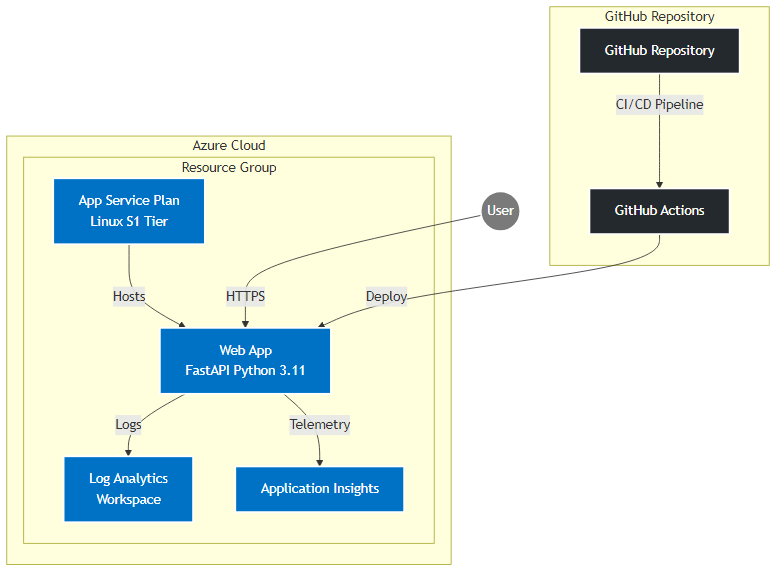

<!--
---
page_type: sample
languages:
- azdeveloper
- python
- bicep
- html
products:
- azure
- azure-app-service
urlFragment: azure-simple-fastapi-appservice
name: Deploy a minimal FastAPI Application on Azure App Service (Python)
description: A tiny, no-frills, template to deploy Python's FastAPI web framework to Azure App Service in the free tier.
---
-->
<!-- YAML front-matter schema: https://review.learn.microsoft.com/en-us/help/contribute/samples/process/onboarding?branch=main#supported-metadata-fields-for-readmemd -->

# FastAPI Azure App Service Template

[](https://vscode.dev/redirect?url=vscode://ms-vscode-remote.remote-containers/cloneInVolume?url=https://github.com/yourusername/azd-simple-fastapi-appservice)
[](https://codespaces.new/yourusername/azd-simple-fastapi-appservice)

## Features
- FastAPI web application deployment to Azure App Service
- Azure Infrastructure as Code using Bicep
- GitHub Actions CI/CD pipeline
- Development container support
- Azure Developer CLI (azd) integration

## Getting Started

### Prerequisites
- [Azure Developer CLI](https://learn.microsoft.com/azure/developer/azure-developer-cli/install-azd)
- [Python 3.11+](https://www.python.org/downloads/)
- [Visual Studio Code](https://code.visualstudio.com/) (recommended)
- [Azure subscription](https://azure.microsoft.com/free/)

### Installation
1. Clone this repository
2. Run `azd init`
3. Run `azd up`

For local development:
1. Install dependencies: `pip install -r src/requirements.txt`
2. Run the application: `python src/app.py`

## Architecture


### System Components
1. **GitHub Repository & CI/CD**
   - Source code repository
   - GitHub Actions for automated build and deployment
   - Continuous integration with Python testing
   - Automated deployment to Azure

2. **Azure Components**
   - **App Service Plan (Linux S1)**
     - Linux-based hosting environment
     - S1 tier for production workloads
     - Supports Python 3.11 runtime
   
   - **Web App**
     - FastAPI application
     - HTTPS-only access
     - Python 3.11 runtime
     - Gunicorn with Uvicorn workers
   
   - **Application Insights**
     - Application performance monitoring
     - Request tracking
     - Error logging
     - User behavior analytics
   
   - **Log Analytics Workspace**
     - Centralized logging
     - Query and analyze logs
     - Monitor system health
     - Custom dashboards

### Data Flow
1. Users access the application via HTTPS
2. App Service handles request routing and SSL termination
3. FastAPI processes requests and returns responses
4. Application logs and metrics are sent to App Insights and Log Analytics
5. GitHub Actions automatically deploy new code changes

## Region Availability
This template can be deployed to any Azure region that supports:
- Azure App Service with Python
- Application Insights
- Azure Log Analytics

Recommended regions:
- East US
- West US 2
- West Europe
- Southeast Asia

## Costs
The main cost components of this template are:
- Azure App Service: Starts at ~$75/month for Basic tier (B1)
- Application Insights: Free for first 5GB/month
- Log Analytics: Free for first 5GB/month

Estimated total cost: $75-100/month for basic production setup

## Security
This template implements several security best practices:
- HTTPS only
- Authentication ready
- Application monitoring and logging
- Regular security updates through GitHub Actions

> **Security Notice**: This template follows secure deployment practices including HTTPS-only access, system-assigned managed identities, and application monitoring. However, you should review the security requirements for your specific use case and implement additional security measures as needed.

For security issues, please see our [Security Policy](SECURITY.md).

## Resources
- [FastAPI Documentation](https://fastapi.tiangolo.com/)
- [Azure App Service Documentation](https://learn.microsoft.com/azure/app-service/)
- [Bicep Documentation](https://learn.microsoft.com/azure/azure-resource-manager/bicep/)
- [Azure Developer CLI](https://learn.microsoft.com/azure/developer/azure-developer-cli/)

## Usage

1. Install AZD and run the following command to initialize the project.

```bash
azd init --template Azure-Samples/azd-simple-fastapi-appservice
```

This command will clone the code to your current folder and prompt you for the following information:

- `Environment Name`: This will be used as a prefix for the resource group that will be created to hold all Azure resources. This name should be unique within your Azure subscription.

2. Login to your Azure account.
```bash
azd auth login
```

3. Run the following command to build a deployable copy of your application, provision the template's infrastructure to Azure and also deploy the applciation code to those newly provisioned resources.

```bash
azd up
```

This command will prompt you for the following information:
- `Azure Location`: The Azure location where your resources will be deployed.
- `Azure Subscription`: The Azure Subscription where your resources will be deployed.

> NOTE: This may take a while to complete as it executes three commands: `azd package` (builds a deployable copy of your application), `azd provision` (provisions Azure resources), and `azd deploy` (deploys application code). You will see a progress indicator as it packages, provisions and deploys your application.

4. Then make changes to app.py and run `azd deploy` again to update your changes.

## Access the free App Service Tier

As the template comes, it is set to a basic plan (see [pricing](https://azure.microsoft.com/en-au/pricing/details/app-service/windows/#pricing) guide), but if you want to get started for free, you can easily update the template before you run `azd up` to leverage the free plan or the discounted developer plan. 

Go to the [/infra/resources.bicep](https://github.com/Azure-Samples/azd-simple-fastapi-appservice/blob/main/infra/resources.bicep) file and update line 58, where the SKU is currently set to `“B1”`. Change this to `“F1”` to deploy up to 10 App Service apps for free on the **free plan** (or `“D1”`  for the **discounted developer rate** if you have more than 10 to deploy concurrently).  

## Notes

This uses the F1 (free) SKU for app service, which has limited CPU and RAM resources.

See the [pricing calculator](https://azure.microsoft.com/en-au/pricing/calculator/) for details on paid SKUs replace the SKU option with a suitable choice.
