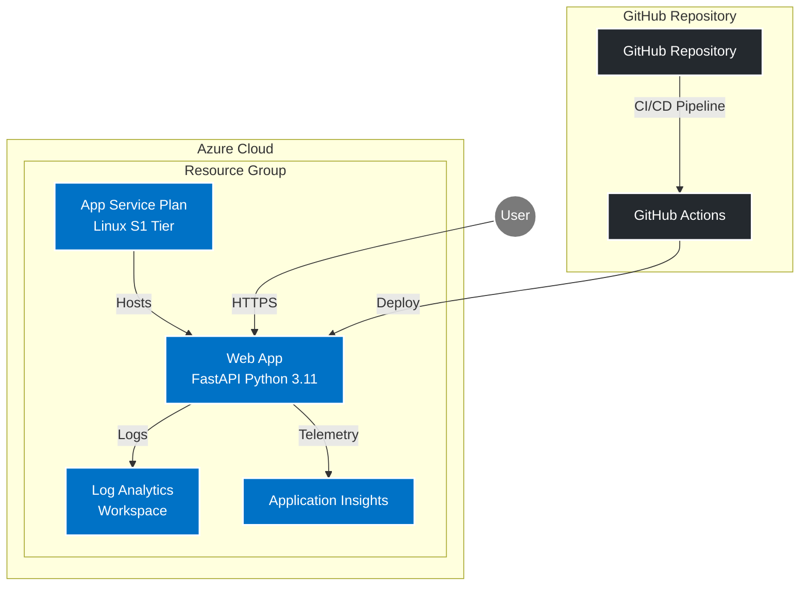

```mermaid
graph TB
    subgraph "GitHub Repository"
        GH[GitHub Repository]
        GA[GitHub Actions]
    end

    subgraph "Azure Cloud"
        subgraph "Resource Group"
            ASP[App Service Plan<br/>Linux S1 Tier]
            WA[Web App<br/>FastAPI Python 3.11]
            LA[Log Analytics<br/>Workspace]
            AI[Application Insights]
        end
    end

    User((User)) -->|HTTPS| WA
    GH -->|CI/CD Pipeline| GA
    GA -->|Deploy| WA
    WA -->|Logs| LA
    WA -->|Telemetry| AI
    ASP -->|Hosts| WA

    classDef azure fill:#0072C6,stroke:#fff,stroke-width:2px,color:#fff
    classDef github fill:#24292E,stroke:#fff,stroke-width:2px,color:#fff
    classDef user fill:#7A7A7A,stroke:#fff,stroke-width:2px,color:#fff
    
    class ASP,WA,LA,AI azure
    class GH,GA github
    class User user
```